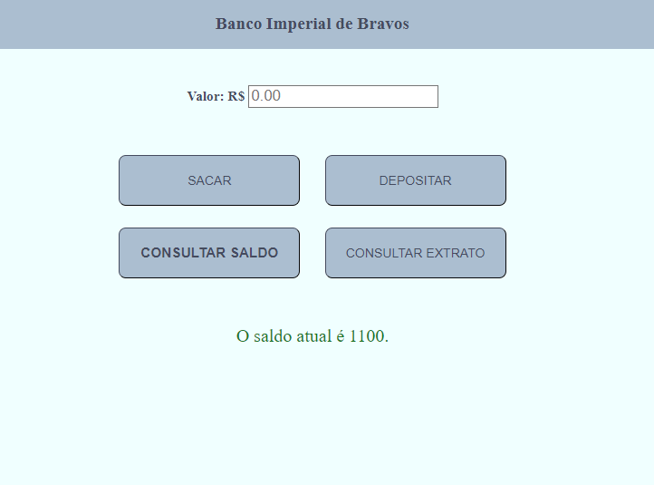

<h2>Bravos Bank</h2>
 

 JS exercise developed during Senai's DEVinHouse course. Account debit, account credit, balance and statement functions are developed. After the user operation, a  4 seconds message is displayed on the screen. Different text colors are used for these messages: green for successful operations and red for error.

 
<ul>
<li>HTML</li>
<li>CSS</li>
<li>JS</li>
</ul>
 
 

 
 
